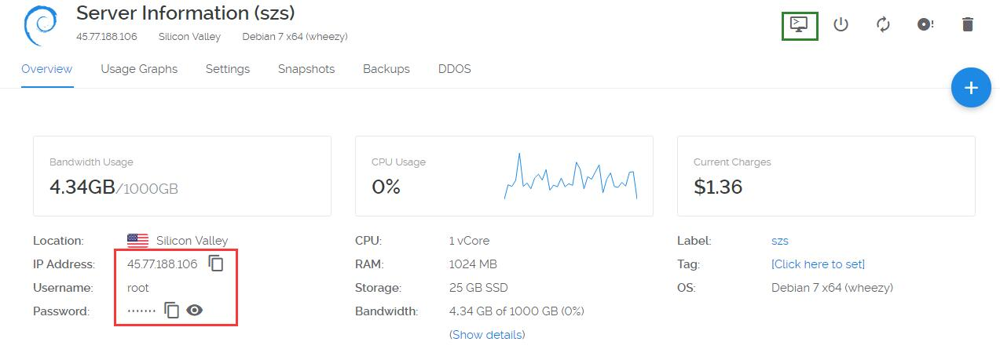
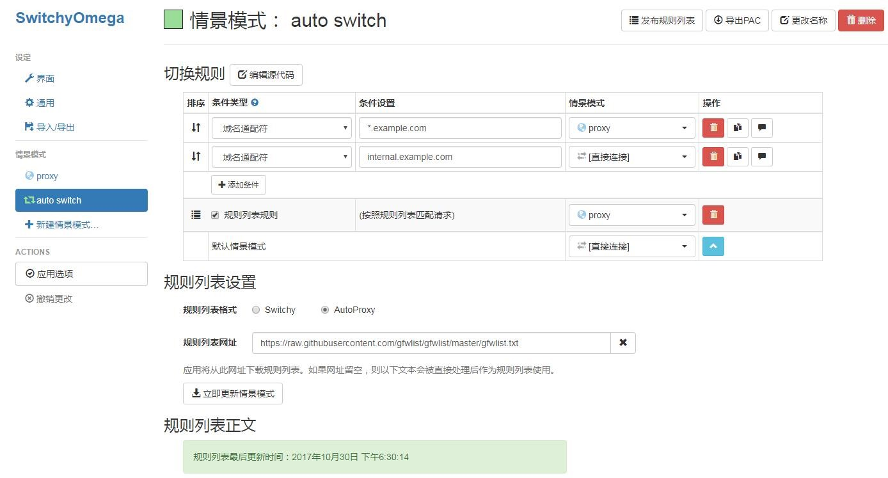

<!DOCTYPE html>
<!-- saved from url=(0051)http://www.cnblogs.com/siaimes-sunzs/p/7808020.html -->
<html lang="zh-cn"><head><meta http-equiv="Content-Type" content="text/html; charset=UTF-8">

<meta name="viewport" content="width=device-width, initial-scale=1">
<title>自建梯子教程 - siaimes</title>
<link type="text/css" rel="stylesheet" href="./自建梯子教程_files/blog-common.css">
<link id="MainCss" type="text/css" rel="stylesheet" href="./自建梯子教程_files/bundle-fighting.css">
<link id="mobile-style" media="only screen and (max-width: 767px)" type="text/css" rel="stylesheet" href="./自建梯子教程_files/bundle-fighting-mobile.css">
<link title="RSS" type="application/rss+xml" rel="alternate" href="http://www.cnblogs.com/siaimes-sunzs/rss">
<link title="RSD" type="application/rsd+xml" rel="EditURI" href="http://www.cnblogs.com/siaimes-sunzs/rsd.xml">
<link type="application/wlwmanifest+xml" rel="wlwmanifest" href="http://www.cnblogs.com/siaimes-sunzs/wlwmanifest.xml">
  

</head>
<body>

<!--done-->

	

		<h1><a id="Header1_HeaderTitle" class="headermaintitle" href="http://www.cnblogs.com/siaimes-sunzs/">自建梯子教程 - siaimes</a></h1>
	
<!--end: blogTitle 博客的标题和副标题 -->
	

<!--end: navigator 博客导航栏 -->

<!--end: header 头部 -->

		

<!--done-->

	

		

		

			
<h1>1 综述</h1>

　　在饱受蓝灯挂掉之苦半个月后，终于决定自己搭建VPS服务器FQ了。虽然网上VPS服务器教程很多，但是我按照那些教程弄好VPS服务器总是不稳定，用着用着就不能用了。这应该是这次GFW升级带来的后遗症，所以以前的教程大多过时了。本文总结了自己在搭建VPS过程中遇到的各种坑，以及最后的解决方案，以供大家参考。

<h1>2 VPS服务器购买</h1>
<h2>2.1 注册vultr</h2>

　　我使用的服务器是vultr。主要因为其按小时计费，随时可以停用服务器。这一点很重要，现在GFW相当高，很容易被墙。一旦被墙月结的损失比较大。其次，vultr本身没有被墙，这一点很重要，不然就是先有鸡还是先有蛋的问题了。当然，可以支付宝付款也是一个加分点。vultr注册地址：<a href="https://www.vultr.com/?ref=7241747" target="_blank">vultr.com</a>。点击链接跳转到vultr，网页右上角有个Create Account就是注册的地方了，接下来就是注册并激活账号了。

<h2>2.2 充值</h2>

　　在购买服务器之前需要先充值。登陆vultr之后如图Billing-&gt;Alipay，选好要充值的金额数，然后Pay with Alipay即可跳转到支付宝扫码支付页面。

<h2>2.3 购买服务器</h2>

　　点击vultr网页右上角的蓝色+图标即可为账户添加服务器。

　　注意，向下滚动有很多选项，不要直接点击Deploy Now，这样会使用默认参数，但不是我们想要的！

　　第一个选项为选择服务器地址（Server Location），建议选择硅谷（Silicon Valley，离google最近），而不要选择日本（用的人多，大部分IP已经被墙）；

　　第二个选项为选择服务器类型（Server Type），即选择服务器操作系统。建议选择Debian 7 x64，默认没有防火墙，会减少很多麻烦。

　　第三个选项为选择服务器大小（Server Size），即选择服务器硬件性能。因为我们使用VPS服务器FQ，所以性能瓶颈不在配置，而在网络带宽之类的。由于vultr的服务器带宽都是100M的，所以服务器当然是往便宜了选。当然，$2.5/mo的一般都是缺货的。选择$5/mo的就好，一个月三十几块钱，要是有好几个人一起分担的话就相当实惠了。

　　第四、五、六三个选项不懂就可以不用管它。

　　第七条要求为即将部署的服务器命名并给一个标签，随意就好。

　　此时可以点击右下角的现在展开（Deploy Now），vultr即开始分配资源，安装系统。此时Servers页面可以看到服务器信息，状态显示installing。当状态切换为Running的时候，服务器就可以使用了。

<h1>3 VPS服务器部署</h1>
<h2>3.1 服务器信息查看</h2>

&nbsp;　　服务器安装结束之后在Servers页面点击刚才购买的服务器名字即可跳转到服务器详情页。如图右上角有一个View console可以直接通过网页连接到服务器，但是由于它是老外弄的，所以不支持中文，不能使用，我们需要使用第三方工具连接到服务器。所以需要知道IP、用户名和密码，如图左下角。

<h2>3.2 远程工具安装</h2>

　　这个第三方远程管理工具叫做Xshell，现在是第五版。自己随便找个连接下载就好了，各个软件管家里面都有的。而且Xshell学生和家庭版是免费的，可以随便使用而不需要破解。安装好Xshell 5之后即可开始连接服务器进行部署了。

<h2>3.3 连接服务器</h2>

　　启动Xshell，从菜单栏的文件-&gt;新建打开新建会话窗口如下图。会话名称随便取一个都可以，主机填写刚才记下来的服务器IP地址。点击确定立即尝试连接服务器，如果能连接上服务器会提示输入用户名和密码。用户名为root，密码可以从vultr服务器详情页拷贝过来。可以记住用户名和密码，这样下次连接就不用再输入那个复杂的密码了（当然密码是可以修改的，但是没必要。系统自动生成的密码强度相当高，可以避免暴力破解。自己设的密码就不好说了，而且还容易忘记）。

　　连接成功之后会出现命令提示符：root@username:~#。接下来就可以开始安装SSR了。如果Xshell一直连不上服务器，那么多半是被墙了，可以尝试着ping一下服务器看看。如果ping不通的话就只能换掉服务器了（<strong>血的教训</strong>：先购买新服务器，再去vultr服务器页面Destroy。反过来的话间隔太小，估计又买到原来的ip了）。

<h2>3.4 安装ShadowsocksR一键管理脚本</h2>

　　接下来要通过一个一键管理脚本安装SSR，作者是在Debian 7 x64上开发的该脚本，这也是为什么推荐这个系统的原因之一。

　　首先需要安装wget（Web Get），使得可以在命令行下载互联网文件。命令如下：

<pre>yum -y install wget</pre>

　　拷贝安装一键管理脚本的命令到控制台运行。以下两个命令分别为脚本命令以及备用命令（其实就是地址不一样），运行任意一个即可。然后等待脚本安装完成，期间如果有提示输入Y记得输入一下。注意，命令的参数包括命令后面的网址，要一起拷贝，虽然显示出来可能是两行，但其实是没有换行的。

<pre>wget -N --no-check-certificate https://softs.fun/Bash/ssr.sh &amp;&amp; chmod +x ssr.sh &amp;&amp; bash ssr.sh

wget -N --no-check-certificate https://raw.githubusercontent.com/ToyoDAdoubi/doubi/master/ssr.sh &amp;&amp; chmod +x ssr.sh &amp;&amp; bash ssr.sh</pre>

　　上述命令运行后会提示你输入数字来选择要做什么。输入 1 ，就会开始安装ShadowsocksR服务端，并且会提示你输入ShadowsocksR的&nbsp;<strong>端口/密码/加密方式/ 协议/混淆</strong>（混淆和协议是通过输入数字选择的） 等参数。虽然没有必要，但是可以考虑重启一下服务器（命令：reboot）。然后输入运行脚本的命令即可开始配置SSR了。运行管理脚本的命令为：

<pre>bash ssr.sh</pre>

<h2>3.5 安装ShadowsocksR</h2>

　　运行脚本：

<pre>bash ssr.sh</pre>

　　输入命令对应的数字来执行命令。

<pre>ShadowsocksR 一键管理脚本脚本 [v2.0.35]
 
 1. 安装 ShadowsocksR
 2. 更新 ShadowsocksR
 3. 卸载 ShadowsocksR
 4. 安装 libsodium(chacha20)
————————————
 5. 查看 账号信息
 6. 显示 连接信息
 7. 设置 用户配置
 8. 手动 修改配置
 9. 切换 端口模式
————————————
 10. 启动 ShadowsocksR
 11. 停止 ShadowsocksR
 12. 重启 ShadowsocksR
 13. 查看 ShadowsocksR 日志
————————————
 14. 其他功能
 15. 升级脚本
 
 当前状态: 已安装 并 已启动
 当前模式: 单端口
 
请输入数字(1-15)：</pre>

　　建议配置为：

<pre>端口：443
加密：chacha20
协议：auth_sha1_v4
混淆：http_simple</pre>

　　所以按照如下步骤配置即可（下面步骤输入的数字可能会随着版本的变化而有细微变化，以实际为准。内容太多，懒得截图了）：

<ol>
<li>　　运行：bash ssr.sh；</li>
<li>　　输入4：安装libsodium，chacha20加密协议的依赖包，等待安装完成，期间如果有提示输入Y记得输入一下；</li>
<li>　　运行：bash ssr.sh；</li>
<li>　　运行安装SSR的命令：1。安装ShadowsocksR；</li>
<li>　　输入端口号：443。443端口为HTTPS协议的默认端口，经过测试是最稳定的，不建议使用其他端口或者使用多端口模式；</li>
<li>　　输入密码：强度越大越好，反正不需要记忆；</li>
<li>　　输入15：使用chacha20加密方式；</li>
<li>　　输入2：使用authsha1_v4协议插件，输入2并确认后会提示是否兼容原版，原版指的是Shadowsocks，没有必要选择兼容，填n后回车即可。</li>
<li>　　输入2：使用http_simple混淆，延时小，可靠性高，同样也不需要兼容原版；</li>
<li>　　然后就是一些限制，一般默认几次回车就好了。&nbsp;</li>
</ol>

　　上面的步骤无误之后一键管理脚本就开始安装SSR了，过一会儿会提示下载文件，输入y后回车即可，然后继续等待。

　　安装完成之后会显示服务器配置信息。包括ip、端口、密码、加密、协议、混淆等。当然这些都没必要记下来（如果Linux客户端应该是要手动输入的），配置客户端的时候只需要下面的SSR连接即可。

<h2>3.6 安装BBR和封禁垃圾端口</h2>

　　运行bash ssr.sh命令后输入14即可进入安装BBR和封禁垃圾端口的界面。这两个都按提示部署一下即可。BBR是google开发的拥塞控制算法，亲测有效，安装之后google秒开，不安装延时相当大。

<h1>4 windows客户端部署</h1>

　　几点说明，首先SSR维护者也已经被请喝茶了，所以SSR项目已经从GitHub移除了，所以SSR的PCA模式已经不能使用了。其次，不要使用360浏览器，国内浏览器厂商和GFW有py交易的。所以，推荐使用SSR+chrome插件SwitchyOmega实现只能chromeFQ的目的。这样SSR使用直连模式，由chrome插件决定当前流量是否走代理。如果你有别的用途可以单独在某个软件内部指定代理地址为SSR的地址：127.0.0.1:1080，如果有需要可以留言，我再看看要不要补充吧。

<h2>4.1 配置ShadowsocksR</h2>

　　<strong>配置SSR之前请将所有安全软件以及国产浏览器关闭，否则IP很快就会被封掉！</strong>

　　ShadowsocksR客户端下载地址<a href="https://github.com/shadowsocksr-backup/shadowsocksr-csharp/releases" target="_blank">SSRforWindows</a>。SSR不需要安装就可以直接运行，但是会在当前目录生成许多运行时文件，所以建议拷贝ShadowsocksR-4.7.0-win文件夹到电脑里面，然后根据自己系统安装的.net情况运行ShadowsocksR-dotnet4.0.exe或者ShadowsocksR-dotnet2.0.exe。为了方便自己建立一个快捷方式到桌面或者设置开机自启即可。运行SSR之后可以在托盘区看到一个小飞机。

　　复制服务器链接到剪贴板，然后右键小飞机剪贴板批量导入ssr://链接…，如图所示：

　　初始的时候软件里会有一台免费的服务器，由于SSR作者被请喝茶，已经没有维护了，是不能用的，需要将其删除掉，然后确定。如图所示：

　　此时已经可以访问google啦！由于服务器是美国的服务器，访问google的时候请使用google.com。其它后缀会慢很多。但是不要急着去玩，后面两步更加重要！！！

<h2>4.2&nbsp;&nbsp;安装SwitchyOmega_Chromium插件</h2>

　　在 Chrome 地址栏输入 chrome://extensions 打开扩展程序，点击底部获取更多拓展程序。搜索proxy即可找到SwitchyOmega插件安装之。

<h2>4.3 配置SwitchyOmega插件（以下每一步配置完之后记得应用选项）</h2>

　　在chrome右上角打开SwitchyOmega配置界面，如图所示：

　　情景模式中的auto switch配置如图所示：注意规则列表格式为AutoProxy，其网址为：

<a title="gfwlist" href="https://raw.githubusercontent.com/gfwlist/gfwlist/master/gfwlist.txt" target="_blank">https://raw.githubusercontent.com/gfwlist/gfwlist/master/gfwlist.txt</a> 

填写完成之后需要先更新情景模式使其生效，如图所示：

　　情景模式中的proxy配置如下图所示，其中127.0.0.1:1080为SSR代理地址，只有流向这个地址的流量SSR才会处理。

　　设定中的初始情景模式选择auto switch，如图所示。这样当检测到目标地址在GFW列表中的时候chrome会让其走SSR代理。否则直连。

　　然后重启chrome，保证SwitchyOmega运行在auto switch模式，否则可能无法正常使用，常见现象有无法访问国外网站、导致访问国内网站速度变慢或无法访问内网等。如图所示：

<h2>4.4 修改SSR参数</h2>

&nbsp;　　刚才没有在配置好SSR之后修改参数的原因在于如果改了参数就访问不了google了，这样安装不了SwitchyOmega插件（其实可以去GitHub下载安装）。所以刚配置好SSR的时候使用了全局模式，保证能访问google，但是这样流量会被国内软件检测到，所以让关闭所有国内软件了。现在要将SSR参数修改为直连模式，等待被chrome调用即可。步骤如下：

　　右键小飞机系统代理模式改为“直连模式”，如图所示：

　　右键小飞机代理规则改为“全局”，如图所示：

　　至此SSRwindows客户端已经配置完成，尽情享受吧！！！

　　可以打开安全软件和杀毒软件了！！！

<h1>5 其他客户端部署指南</h1>

　　Linux客户端一键安装配置脚本：<a href="https://github.com/the0demiurge/CharlesScripts/blob/master/charles/bin/ssr" target="_blank">SSRforLinux</a>；

　　Linux客户端GUI版本：<a href="https://github.com/erguotou520/electron-ssr/releases" target="_blank">SSRforLinuxGUI</a>；

　　MAC客户端：<a href="https://github.com/shadowsocksr-backup/ShadowsocksX-NG/releases" target="_blank">SSRforMAC</a>；

　　Android客户端：<a href="https://github.com/shadowsocksr-backup/shadowsocksr-android/releases" target="_blank">SSRforAndroid</a>。

		
		
	

	

<!--end: topics 文章、评论容器-->

<!--end: home 自定义的最大容器 -->

		

<!--done-->
Copyright ©2017 siaimes

<!--end: footer -->

</body></html>